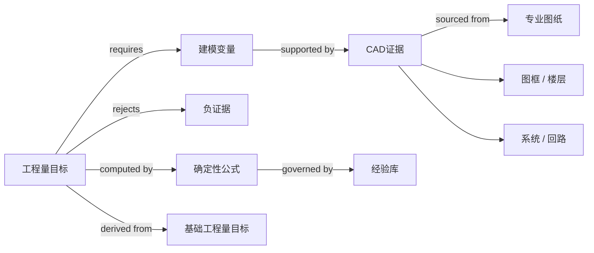

# v1.3 Target-aware Evidence Registry

v1.3 将“把所有 CAD 信息一次性交给模型”改为“每个工程量目标先声明所需变量，再定向检索证据”。经验库定义解题 recipe，但不包含 Case-001 的工程量答案。



## Target recipes

380 个目录目标被分为 12 类，其中 366 个参与评分：

| Target type | Catalog targets | Required context examples |
|---|---:|---|
| device-count | 164 | 专业图、图框、楼层、语义块、稳定ID、可计数门控 |
| fitting-count | 56 | 系统、管径、管网拓扑、管件实例 |
| surface-area | 44 | 基础长度、管径、内/外表面、公式 |
| pipe-length | 41 | 系统、管径、水平路线、拓扑；立管为可选增强 |
| conductor-length | 16 | 回路号、导线规格、起终设备、回路路径 |
| terminal-count | 14 | 回路路径、起终设备、端接规则 |
| audit-total | 14 | 组成目标及求和公式，不从 CAD 直接估计 |
| conduit-length | 11 | 配管规格、路线、拓扑和楼层 |
| protective-area | 8 | 基础长度、外径、保温厚度、公式 |
| grounding-route-length | 6 | 防雷/接地路线类型、水平路线、拓扑 |
| insulation-volume | 5 | 基础长度、外径、保温厚度、公式 |
| route-attachment-count | 1 | 路线拓扑和附件布置规则 |

逐目标需求公开在[data-requirements-v1-3.json](../../benchmarks/full-quantity-v0/data-requirements-v1-3.json)。完整 Evidence Registry 位于私有`outputs/`，不公开 CAD 标签、坐标或逐目标证据。

## Current context coverage

| Metric | Result |
|---|---:|
| Scored targets | 366 |
| Mean required-context completeness | 68.57% |
| All required variables fully available | 0 |
| At least one partial/missing variable | 366 |
| Targets with a completely missing critical variable | 47 |
| Graph nodes | 466 |
| Graph edges | 7,700+ |

`available=1`、`partial=0.5`、`missing=0`，只对 required variables 求平均。68.57%不是预测准确率，而是“当前是否有对应证据提供器”的结构指标。`partial`包括图框候选已存在但边界不权威、管径文字存在但没有绑定到全部路线等情况。

当前最集中的完全缺失项：

| Missing variable | Affected targets |
|---|---:|
| circuit-route | 30 |
| termination-policy | 14 |
| diameter | 8 |
| material-outside-diameter | 8 |
| insulation-thickness | 8 |
| attachment-rule | 1 |

因此下一步优先级很明确：先构建电气回路图和端接规则，再补保温外径/厚度解析；设备、管件和管线任务虽然没有完全缺失字段，但仍有大量`partial`关系需要从候选绑定升级为权威绑定。

## Reproduce

```bash
npm run benchmark:v1.3:requirements
npm run benchmark:v1.3:registry
npm test
```
